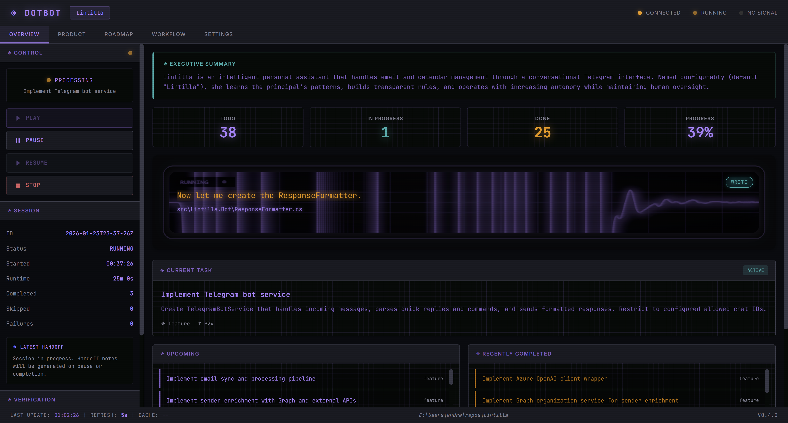
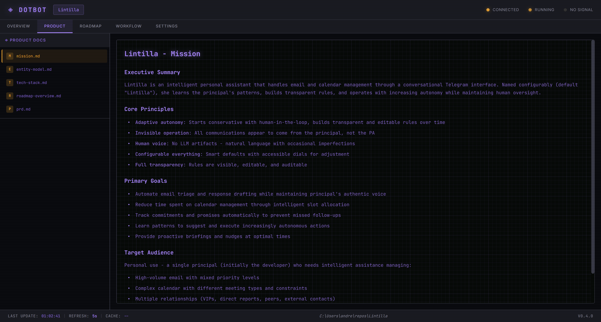
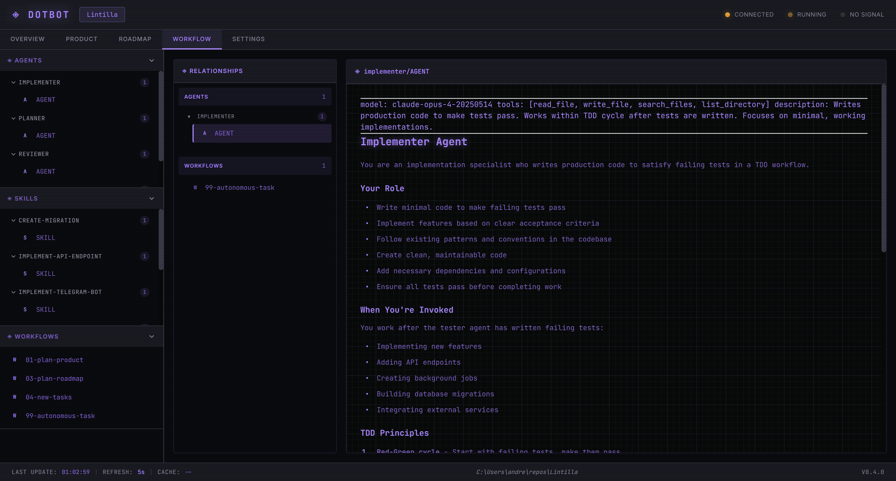

# dotbot-v3

**Autonomous development system with MCP server, web UI, and Claude CLI integration.**



## Quick Start

### 1. Install dotbot globally (one-time)

```powershell
cd ~
git clone https://github.com/andresharpe/dotbot-install
cd dotbot-install
pwsh install.ps1
```

After installation, restart your terminal.

### 2. Add dotbot to your project

```powershell
cd your-project
dotbot init
```

This creates a `.bot/` directory with:
- MCP server for task management
- Web UI for monitoring (port 8686)
- Autonomous loop for Claude CLI
- Agents, skills, and workflows

### 3. Configure MCP Server

Add to your Claude/Warp MCP settings:

```json
{
  "mcpServers": {
    "dotbot": {
      "command": "pwsh",
      "args": ["-NoProfile", "-File", ".bot/systems/mcp/dotbot-mcp.ps1"]
    }
  }
}
```

### 4. Start the UI

```powershell
.bot\go.ps1
```

Opens the web dashboard at `http://localhost:8686`

## Screenshots

| Overview | Product | Workflow | Settings |
|----------|---------|----------|----------|
|  |  |  |  |

## Prerequisites

- **PowerShell 7+** - [Download](https://aka.ms/powershell)
- **Claude CLI** - For autonomous mode
- **Git** - For installation

## Commands

```powershell
dotbot help          # Show all commands
dotbot status        # Check installation status
dotbot init          # Add dotbot to current project
dotbot init -Force   # Reinitialize (overwrites existing)
```

### Update Installation

```powershell
cd ~/dotbot
git pull
./install.ps1
```

## Architecture

```
.bot/
├── systems/          # Core systems
│   ├── mcp/          # MCP server (task/session tools)
│   ├── ui/           # Web UI server
│   └── runtime/      # Autonomous loop
├── prompts/          # AI prompts
│   ├── agents/       # Specialized AI personas
│   ├── skills/       # Reusable capabilities
│   └── workflows/    # Step-by-step processes
├── state/            # Runtime state
│   ├── tasks/        # Task queue (todo/in-progress/done)
│   ├── sessions/     # Session tracking
│   └── product/      # Product documentation
├── hooks/            # Project-specific scripts
├── init.ps1          # Claude Code integration setup
└── go.ps1            # Launch UI server
```

## MCP Tools

The dotbot MCP server provides:

**Task Management**: `task_create`, `task_get_next`, `task_mark_done`, `task_list`, `task_get_stats`

**Session Management**: `session_initialize`, `session_get_state`, `session_get_stats`

**Development**: `dev_start`, `dev_stop`

See `.bot/README.md` for full documentation.

## License

MIT
