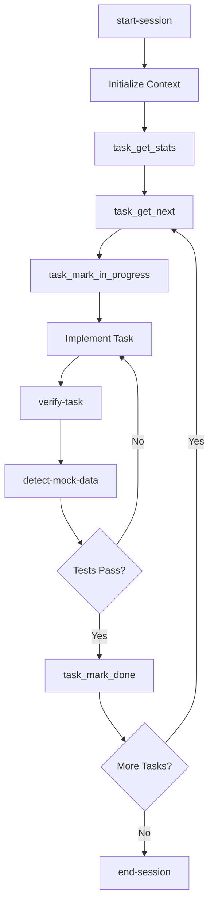

# 🤖 dotbot - Autonomous Development System

## Overview

Project-agnostic autonomous development using Claude Code's agents/skills model with TDD-focused workflow.

## 📋 Complete Workflow Sequence

### Phase 1: Planning
```
1. dotbot-1-plan-product
   └── Creates: mission.md, tech-stack.md
   
2. dotbot-2-plan-roadmap
   └── Creates: tasks as JSON files in .bot/workspace/tasks/todo/
```

### Phase 2: Specification (Optional)
```
3. dotbot-3-shape-spec
   └── Creates: initial spec structure
   
4. dotbot-4-write-spec
   └── Creates: complete spec.md
   
5. dotbot-5-create-tasks
   └── Creates: tasks.md with task groups
```

### Phase 3: Implementation (Choose Your Path)

#### 🤖 Path A: Autonomous Feature-Driven
```
7. dotbot-7-implement-feature
   └── Autonomous agent implements features from queue
   └── Uses: MCP tools, session management
   └── Philosophy: Build what's missing, never skip
```

#### 👤 Path B: Traditional Task-Driven
```
6. dotbot-6-implement-tasks
   └── Implement specific task groups
   
6. dotbot-6-orchestrate-tasks
   └── Orchestrate multiple task groups
```

### Phase 4: Optimization
```
8. dotbot-8-improve-rules
   └── Refine standards and patterns
```

## 🔄 Feature-to-Code Mapping

### How Features Become Code

```javascript
// Task (JSON in .bot/workspace/tasks/todo/)
{
  "id": "uuid-here",
  "name": "User Authentication",
  "category": "core",
  "priority": 1,
  "effort": "L",
  "acceptance_criteria": [
    "Users can register with email",
    "Passwords are securely hashed",
    "Sessions expire after 24 hours"
  ],
  "steps": [
    "Create user database schema",
    "Implement registration endpoint",
    "Add password hashing",
    "Create login endpoint",
    "Implement session management"
  ]
}
```

⬇️ **Transforms Into** ⬇️

```
Autonomous Implementation:
1. Database migration for users table
2. User model with validation
3. Registration API endpoint
4. BCrypt password hashing
5. JWT session tokens
6. Login API endpoint
7. Session middleware
8. Frontend registration form
9. Frontend login form
10. Tests for all components
```

## 🤖 Autonomous Agent Lifecycle

### Session Flow


### Key Commands

#### Session Management
- `start-session` - Initialize autonomous session
- `end-session` - Clean session termination

#### Task Management (MCP Tools)
- `task_get_stats` - Overall progress statistics
- `task_get_next` - Get highest priority task
- `task_mark_in_progress` - Mark task as in-progress
- `task_mark_done` - Mark task as complete
- `task_mark_todo` - Mark task as todo (reset/revert)
- `task_list` - List and filter tasks
- `task_create_bulk` - Batch create tasks

#### Verification
- `verify-task` - Comprehensive testing
- `detect-mock-data` - Scan for forbidden patterns

## 📁 Directory Structure

```
.bot/
├── tasks/             # Task queue (MCP managed)
│   ├── todo/          # Pending tasks (JSON files)
│   ├── in-progress/   # Currently being worked on
│   └── done/          # Completed tasks
├── sessions/          # Session tracking
│   ├── progress.txt   # Continuous progress log
│   ├── session-*.json # Individual session records
│   └── history/       # Archived sessions
├── commands/          # All command definitions
├── workflows/         # Detailed workflows
├── agents/           # Agent definitions
├── mcp/              # MCP tool implementations
│   └── tools/        # Individual tool directories
└── specs/            # Specifications and tasks

.warp/
└── workflows/        # Warp AI shortcuts
```

## 🎯 Core Principles

### For Autonomous Agents

1. **Test-Driven Development** - Tasks are test cases that drive implementation
2. **Build What's Missing** - Never skip because functionality doesn't exist
3. **Real Data Only** - No mock data in production features
4. **Clean State** - Always leave codebase working
5. **Progress Over Perfection** - Complete one task well per session
6. **Verification Required** - Browser automation testing before marking complete

### Build vs Skip Decision Tree

```
Is functionality missing?
├── YES → BUILD IT
│   ├── Page doesn't exist → Create the page
│   ├── API missing → Implement the API
│   ├── Database table missing → Create migration
│   └── Component missing → Build component
└── NO → Is it external?
    ├── YES (API keys, external service) → Skip
    └── NO → Build it
```

## 💡 Implementation Examples

### Example 1: Core Task
```bash
# Task: "User Authentication"
# Category: core

# Agent will:
1. Create user table migration
2. Build user model
3. Implement registration endpoint
4. Add password hashing
5. Create login endpoint
6. Build session management
7. Create frontend forms
8. Write comprehensive tests
9. Verify with browser automation
```

### Example 2: UI Task
```bash
# Task: "User Dashboard"
# Category: feature

# Agent will:
1. Create dashboard route
2. Build dashboard component
3. Fetch user data API
4. Create sub-components
5. Add styling
6. Implement interactivity
7. Write integration tests
8. Verify all functionality
```

## 🔧 Quick Start for Testing

### For Autonomous Development:
```bash
# 1. Create tasks (if not already done)
warp ai
> Run dotbot-2-plan-roadmap

# 2. Start autonomous implementation
warp ai
> Run dotbot-7-implement-feature

# The agent will:
# - Start session
# - Get next task
# - Implement it completely
# - Verify it works
# - Mark it done
# - End session
```

### For Traditional Development:
```bash
# 1. Create spec and tasks
warp ai
> Run dotbot-3-shape-spec
> Run dotbot-4-write-spec
> Run dotbot-5-create-tasks

# 2. Implement tasks
warp ai
> Run dotbot-6-implement-tasks
```

## 📊 Progress Tracking

### Check Overall Progress
```
Use task_get_stats tool
```

Returns:
- Total tasks
- Completed count
- In-progress count
- Percentage complete
- Effort remaining

### View Task Queue
```
Use task_list tool with status='todo'
```

### Review Session History
```
Check .bot/workspace/sessions/progress.txt
Check .bot/workspace/sessions/latest-handoff.md
```

## 🔄 Integration Points

### Tasks ↔ Subtasks
- Tasks can have embedded `steps` (subtasks)
- Subtasks can be generated from `acceptance_criteria`
- Complex tasks can spawn mini-specs with subtasks

### Sessions ↔ Git
- Each session creates commits
- Session files track commit hashes
- Progress preserved in version control

### MCP Tools ↔ Files
- Tasks stored as JSON files
- Tools manipulate files directly
- Version control friendly

## ⚡ Key Advantages

### Autonomous Path
- ✅ Continuous development across sessions
- ✅ Self-directed implementation
- ✅ Build-what's-missing philosophy
- ✅ Automatic progress tracking
- ✅ Session handoff for fresh contexts

### Traditional Path
- ✅ Human oversight and control
- ✅ Detailed task orchestration
- ✅ Standards enforcement
- ✅ Group-based implementation

## TODO

- [ ] Create `.bot/setup.ps1` bootstrap script to install tooling dependencies (gitleaks, etc.) and configure git hooks
- [ ] Move pre-commit hook template to `.bot/hooks/git/pre-commit` so it can be installed by setup script

## Ready to Test

The system is now complete with:
- Task-based planning (plan-roadmap)
- Autonomous implementation (implement-feature)
- Session management (start/end-session)
- Verification framework (verify-task, detect-mock-data)
- Progress tracking (MCP tools)
- Traditional task path (still available)

Start a new Warp window and run `dotbot-7-implement-feature` to see autonomous development in action!
